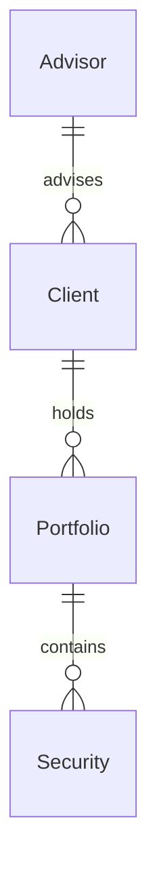

# counselor

Entity layer for **Task 2 of Forage's Wells Fargo software engineering program** — a small portfolio-management service for a financial-advisory firm.

> **Status: partial implementation.** The JPA entity model is complete. There are no controllers, repositories, services, or tests yet, and the service does not expose any HTTP endpoints. The REST layer is the remaining work.

---

## Tech stack

| | |
| --- | --- |
| Language | Java 19 |
| Framework | Spring Boot 3.0.4 |
| Persistence | Spring Data JPA (Hibernate) |
| Database | H2 (in-memory, for development) |
| Build | Maven, with the wrapper committed (`.mvn/`, `mvnw`, `mvnw.cmd`) |

Maven coordinates: `com.wellsfargo:counselor:0.0.1-SNAPSHOT`.

---

## Prerequisites

- JDK 19 or newer
- Maven is **not** required — use the committed wrapper

---

## Getting started

```bash
# Windows
mvnw.cmd spring-boot:run

# macOS / Linux
./mvnw spring-boot:run
```

Or build a jar:

```bash
./mvnw clean package
java -jar target/counselor-0.0.1-SNAPSHOT.jar
```

The application starts on port 8080. Because the only implemented layer is the entity model, there is nothing to call over HTTP yet.

Spring Boot 3.0.4 requires Java 17 or newer, so any JDK 19 toolchain works.

---

## Project structure

```
.
├── mvnw, mvnw.cmd, .mvn/        Maven wrapper
├── pom.xml
└── src/main/java/com/wellsfargo/counselor/
    ├── Entrypoint.java          Spring Boot entry point
    └── entity/
        ├── Advisor.java         advisor record
        ├── Client.java          client record
        ├── Portfolio.java       portfolio, belongs to a Client
        └── Security.java        security holding within a portfolio
```

---

## Data model

Four entities under the `com.wellsfargo.counselor.entity` package.

### `Client`

| Field | Type | Constraints |
| --- | --- | --- |
| `clientId` | `long` | `@Id` |
| `firstName` | `String` | not null |
| `lastName` | `String` | not null |
| `address` | `String` | not null |
| `phone` | `String` | not null |
| `email` | `String` | not null |

### `Advisor`

| Field | Type | Constraints |
| --- | --- | --- |
| `advisorId` | `long` | `@Id` |
| `firstName` | `String` | not null |
| `lastName` | `String` | not null |
| `address` | `String` | not null |
| `phone` | `String` | not null |
| `email` | `String` | not null |

### `Security`

| Field | Type | Constraints |
| --- | --- | --- |
| `securityId` | `long` | `@Id` |
| `name` | `String` | not null |
| `category` | `String` | not null |
| `purchaseDate` | `LocalDate` | not null |
| `purchasePrice` | `double` | not null |
| `quantity` | `int` | not null |

### `Portfolio`

| Field | Type | Constraints |
| --- | --- | --- |
| `portfolioId` | `long` | `@Id` |
| `creationDate` | `LocalDate` | not null |
| `client` | `Client` | `@ManyToOne`, `@JoinColumn(name = "clientId")`, not null |



`Portfolio` is the aggregate root of the domain: it belongs to exactly one `Client` and groups the `Security` holdings that client has bought.

---

## Notes on the current state

- **Primary keys are assigned, not generated.** Every entity declares `@Id` on a `long` field with no `@GeneratedValue`, so IDs are expected to be supplied by the caller once the repository layer lands.
- **No inverse side on `Client`.** `Portfolio.client` is the owning side of the relationship; `Client` has no matching collection, and `Security` is not yet mapped to `Portfolio` from either side.
- **No tests.** There is no `src/test` tree.
- **Spring Boot 3.0.4 is well behind the current 3.5.x line.** It is left as-is because this is coursework against a fixed program spec; upgrading is a deliberate decision rather than an oversight.
- **The default branch is `flow`,** not `main`.
- **No license file.** The repository is unlicensed until one is added.
